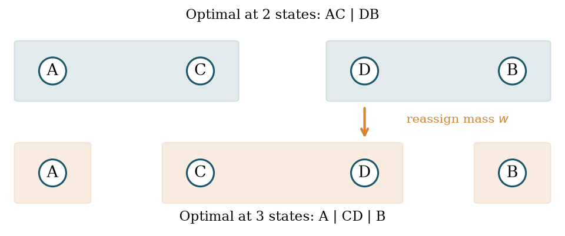

# information-driven-neural-growth

**Information, irreversible representations, and neural growth**  
Wenyu Huang · University of California San Diego

A research archive spanning mathematical limits, controlled synthetic learning studies, memory/query bounds, and a finite statistical benchmark. It contains the papers, proofs, code, configurations, retained evidence and negative results from Phases 1–10 and the additive-risk follow-up.

*An original schematic of incompatible flat optima. It is not a neural-training result.*

## Start here

- [Paper catalogue](docs/PAPERS.md): English PDFs and complete LaTeX, organized by question and stage.
- [Research map and current conclusions](docs/RESEARCH_MAP.md): what later stages settle, what earlier findings remain, and what is still open.
- [Reproduce and audit](docs/REPRODUCING.md): clean builds, checks of saved evidence, and separately identified full experiments.
- [Publication scope, exclusions and provenance](docs/PUBLICATION_SCOPE.md): public derivatives, large-data recovery and known limitations.
- [Known corrections](docs/ERRATA.md) and [validation actually performed for this release](docs/VALIDATION.md).

The latest theoretical paper is **Phase 10, _Quartet Reduction and Sharp Degree Bounds at the Last Two Capacities_**. It complements Phase 8 and Phase 9; it does not replace their other results or the earlier learning experiments. The additive-risk follow-up remains a separate study, with its definitions, fixed confirmation counts and exact certificates.

## Research progression

| Stage | Question and supported result |
|---|---|
| [1](phases/phase1/SCIENTIFIC_STATUS.md) | Unbounded cost of compatible finite-representation growth under total Bayes log loss; explicit deterministic and stochastic constructions. |
| [2](phases/phase2/SCIENTIFIC_STATUS.md) | Realizable split directions and operation-aligned information: restricted theory and synthetic learning, with benefits weakened by longer training or ordinary starts. |
| [3](phases/phase3/SCIENTIFIC_STATUS.md) | Repeated neural growth and fresh-evidence costs; a restricted audit-interface lower bound, gates, controls and unresolved residual-score advantages. |
| [4](phases/phase4/SCIENTIFIC_STATUS.md) | Sharp four-state source-mass order, coherent finite/evidence manuscripts, and retained-evidence neural diagnostics. |
| [5](phases/phase5/SCIENTIFIC_STATUS.md) | Failure diagnostics for retained moments, exact quadratic results and ordinary-start learning; generic originality and risk-advantage claims are limited. |
| [6](phases/phase6/SCIENTIFIC_STATUS.md) | A prespecified mean risk–work endpoint passed in a narrow scheduled quadratic study, with tail sensitivity and unfavorable budget/threshold controls retained. |
| [7](phases/phase7/SCIENTIFIC_STATUS.md) | Continuous exact residual-query memory dimension and smooth-loss hierarchy boundaries; not general learning or fixed-tolerance memory lower bounds. |
| [8](phases/phase8/SCIENTIFIC_STATUS.md) | Polynomial-curvature degree bounds, equal/fixed-weight sharp order and an all-capacity upper bound. |
| [9](phases/phase9/SCIENTIFIC_STATUS.md) | Sharp arbitrary-weight four-state degree order, a coordinate-method obstruction and a restricted indicator-ReLU bridge. |
| [10](phases/phase10/SCIENTIFIC_STATUS.md) | Quartet domination and matching degree order for the last two capacities, uniformly over source count. |
| [Additive risk](studies/additive-risk/SCIENTIFIC_STATUS.md) | A finite four-state window under fixed loss amplitude; three positive population screens, seven negative screens, one preselected statistical confirmation. |

## Interpret the results within their models

The archive does **not** establish a universal information-driven self-growing neural network, general real-data superiority, autonomous architecture selection, or a deployment-ready training algorithm. Function-preserving growth is distinct from risk reduction; population optimal refitting is distinct from finite-sample optimization. Specialized loss and representation assumptions matter.

For the additive-risk pilot, the public state masses and complete special loss are fixed. The confidence procedure controls false positives over all four-state posteriors, while the analytic power guarantee concerns one specified alternative. The one recorded synthetic realization is not an empirical estimate of power. Read the [statistical technical review](reviews/statistical-closure/README.md) before transferring this conclusion to learning settings.

These are working research papers and technical materials. Internal review is not external peer review, author verification, institutional endorsement or a historical-priority certificate. Earlier exploratory, post-hoc and confirmatory studies are distinguished in their own records.

## Reproduction environment

Research scripts use Python and, where specified, NumPy, SciPy, mpmath and Matplotlib. Recorded versions are in [requirements.txt](requirements.txt); PDF builds require a separately available TeX distribution. No environment or third-party package is bundled. Use a new working copy for any command that writes results.

Start with the [non-training verification and paper build commands](docs/REPRODUCING.md). Full experiment regeneration is optional and explicitly separated from the checks performed during publication. Some large generated arrays are excluded; the [recovery guide](docs/EXCLUDED_ARTIFACTS.md) states what can be checked immediately and what requires regeneration.

## Attribution and license

Author: **Wenyu Huang, UC San Diego**. Cite the specific paper and stage being used; the archive contains several distinct research contributions and historical versions.

**No open-source license has been specified.** A license decision remains with the author. Third-party literature is cited rather than redistributed.
