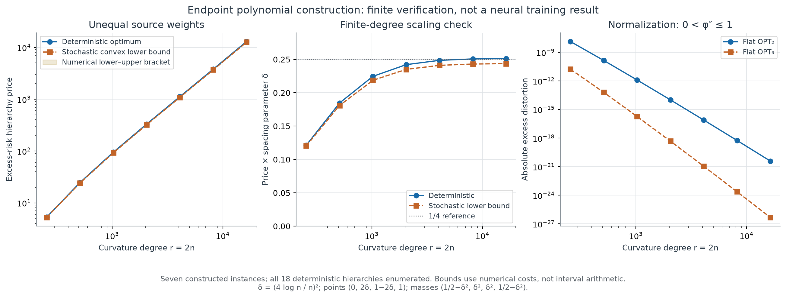
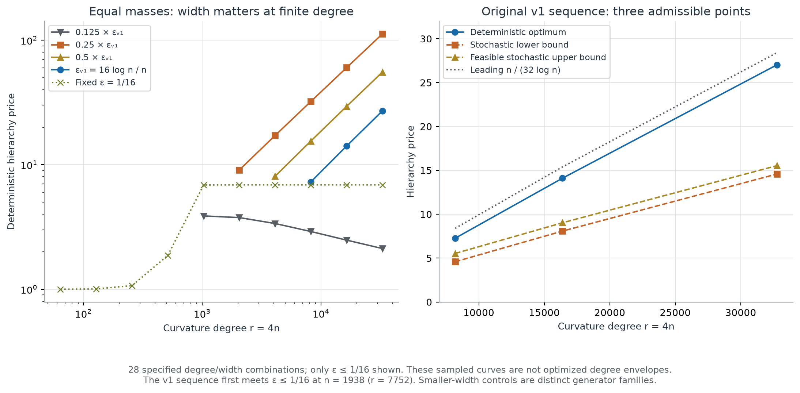

# Phase 8 finite hierarchy experiments

2026-10-07 UTC. Local numerical research record. No training, installations, or external transmission.

The discriminating experiment supports the new **unequal-weight endpoint construction**: polynomial curvature can produce much larger finite hierarchy prices than the equal-mass interior construction at comparable degrees. The experiment checks constructed instances and formulas. It does not prove an asymptotic envelope, a sharp constant, or a neural training improvement. The extension proof is a separate deliverable in [unequal_weights_endpoint.tex](../../extensions/unequal_weights_endpoint.tex).

## Sources and question

The supplied v1 manuscript defines Jensen distortion, deterministic and stochastic hierarchy prices, and the interior squared-Chebyshev family in [curvature_hierarchy.tex](../../../historical/v1/curvature_hierarchy.tex), sections “Distortion and hierarchy definitions” and “A polynomial lower construction at fixed posteriors”. Its [fixed_quartet.tex](../../../historical/v1/fixed_quartet.tex) derives compatible optimizer choices for equal masses. [uniform_log_upper.tex](../../../historical/v1/uniform_log_upper.tex) proves the spacing-uniform equal-mass order. That result has equal weights as an essential stated hypothesis; these experiments do not dispute it.

The experimental question was whether **shrinking inner source masses together with near-endpoint gaps** permits a different degree scaling. A first hinge screen supplied evidence to the mathematical extension branch; the resulting endpoint polynomial was then independently implemented. This is adaptive exploratory construction checking, not a preregistered statistical experiment. There are no confidence intervals or sampled population claims.

## Computation and correctness gates

Every instance enumerates all 7 two-cell partitions, all 6 three-cell partitions, and all 18 nested pairs, including noncontiguous partitions. Original source masses are retained in every cell. A cell cost is evaluated as the integral of its nonnegative Jensen hinge kernel against curvature. Its two-sided form avoids subtracting nearly equal generator values.

For a degree-4n curvature, an order-(2n+2) Gauss–Legendre rule integrates each linear-kernel segment exactly in exact arithmetic. The degree-2n endpoint family uses order n+2. This polynomial-degree fact is **not** a floating-point error certificate. We therefore used independent higher-order nodes and arbitrary-precision analytic integration, with results saved in `raw/`.

| Check | Scope | Maximum observed relative cell discrepancy |
|---|---|---:|
| Interior family, independent analytic antiderivative at 150 decimal digits | n=4,16,64; all 11 nonsingleton cells | 3.66×10⁻¹⁵ |
| Interior family, two Gauss–Legendre orders | n=256,2048,8192; all cells | 4.28×10⁻¹² |
| Endpoint family, independent analytic antiderivative at 350 decimal digits | n=128; all 11 nonsingleton cells | 1.33×10⁻¹⁴ |
| Endpoint family, two Gauss–Legendre orders | n=128,…,8192; all cells | 2.03×10⁻¹¹ |

The hinge cost formulas and both explicit-channel costs from v1 were checked against full enumeration. Thirty random feasible 4→3→2 Markov channels checked the interior implementation at n=64, seed 2026100708. Twenty-four additional channels checked the endpoint implementation at n=128 and 1024, seed 2026100709. Their complete transition matrices are saved. Every tested channel's ratio was above the deterministic-hull convex lower bound. These are implementation checks, not stochastic optimization or an exhaustive channel search.

The stochastic lower bound minimizes the maximum of the two normalized costs over the convex hull of the 18 deterministic ratio vectors. In two dimensions its minimum is attained at a vertex or on a segment between two input vertices. Random-function-table revelation and refinement make this a lower bound for every admissible stochastic chain. A convex mixture of deterministic cost vectors is **not** silently treated as an implementable cardinality-constrained channel. The upper bound is the smaller of an actually evaluated explicit channel and the best deterministic hierarchy, which is itself a feasible channel.

## Endpoint result

For n∈{128,256,512,1024,2048,4096,8192}, set

\[
\delta=(4\log n/n)^2,\quad
x=(0,2\delta,1-2\delta,1),\quad
p=(1/2-\delta^2,\delta^2,\delta^2,1/2-\delta^2).
\]

With \(P_n(t)=T_n((2t-1-\delta)/(1-\delta))^2\), \(Z_n=\int_0^1P_n(t)dt\), use curvature
\(g_n(t)=P_n(t)/Z_n+P_n(1-t)/Z_n+\delta^2\), of degree r=2n. All seven instances have the flat two-cell optimum 01|23 and the flat three-cell optimum 0|12|3.

| Curvature degree r | Deterministic price | Stochastic lower bound | δ × deterministic price |
|---:|---:|---:|---:|
| 256 | 5.27864 | 5.23321 | 0.121358 |
| 512 | 24.5986 | 24.1088 | 0.184663 |
| 1024 | 94.5602 | 92.0520 | 0.224608 |
| 2048 | 330.330 | 320.652 | 0.242169 |
| 4096 | 1121.11 | 1087.17 | 0.248625 |
| 8192 | 3800.43 | 3684.21 | 0.250753 |
| 16384 | 12984.7 | 12586.6 | 0.251368 |

The deterministic price also supplies the stochastic upper bound for this family: the old v1 explicit channel was much worse (205243.8 at r=16384). Thus the top finite instance has a numerically evaluated stochastic bracket [12586.6,12984.7], not an exact stochastic optimum. The ratio ρdet/(r/log r) rises from 0.11434 to 7.69071 across this finite sequence. The proof, rather than this trend alone, is needed to reject an arbitrary-weight O(r/log r) bound.

These sampled degrees do **not** satisfy every loose sufficient inequality in the asymptotic extension proof. In particular, its coarse 128n²δ² condition is not small enough throughout n≤8192; the independent proof audit supplies a conservative analytic threshold n≥65536. We directly evaluated the finite costs and did not apply that condition to these points. Numerical support below a proof threshold is not verification of each sufficient proof inequality.

Absolute costs are a crucial limitation. We normalize by the analytic curvature upper bound \(M_b=2\max_tP_n(t)/Z_n+\delta^2\); then \(0<g_n/M_b\le1\). At r=16384, normalized flat OPT₂=3.84307×10⁻²¹ and OPT₃=4.68112×10⁻²⁷. The large price does not imply a large absolute loss. This is a different scaling from using the exact maximum, but it preserves every price and provides a valid bounded-curvature generator.

These numerical absolute costs concern the displayed points including 0 and 1. An affine move to interior binary posteriors preserves prices; a curvature bound over the entire new [0,1] must then also control the polynomial outside the old source hull. The extension's full-support theorem handles that normalization separately. **Do not reuse these absolute-cost columns as the normalized costs of its interior-transformed construction.**

## Equal-mass controls and negative results

The original v1 sequence uses ε=16log n/n and requires ε≤1/16. The first integer n≥2 meeting this is **1938**, degree 7752. Our three admissible sampled original-sequence points are:

| r=4n | ε | Deterministic price | Stochastic bracket | n/(32log n) reference |
|---:|---:|---:|---:|---:|
| 8192 | 0.0595673 | 7.26645 | [4.58790,5.53026] | 8.39386 |
| 16384 | 0.0324913 | 14.1023 | [8.07689,9.02771] | 15.3887 |
| 32768 | 0.0175994 | 27.0290 | [14.5837,15.5383] | 28.4100 |

The full 28-row scan also fixes ε=1/16 and uses smaller multiples of 16log n/n, always retaining ε≤1/16. They are distinct generator families, not lower-degree evaluations of the original asymptotic sequence. The controls show:

- At ε=1/16, r=64 gives price exactly 1; r=128 gives 1.00544. Low-degree localization is weak.
- Fixed ε=1/16 saturates near 6.88889 as degree increases, so increasing degree alone is insufficient.
- At n=8192, using ε=0.25εv1 gives price 112.170, while 0.125εv1 gives only 2.12227 despite a hinge-reference prediction of 225.795. An excessively narrow polynomial needle still leaks too much curvature at that finite degree. This negative result is retained rather than selected away.
- The 24-row fixed-generator spacing/weight screen contains many compatible cases with price 1. Tiny inner weights alone do not produce the endpoint separation without matching the geometry and curvature.

The uniform upper proof's constants are much too large for these degrees to provide a numerical sharp-envelope verification: log K=log64+100πlog512≈1963.986. We make no claim to have numerically certified that theorem's threshold or optimal leading constants.

## Neural splitting interface and limits

The hierarchy theorem applies directly only after defining a **finite task representation** whose states, conditional Bernoulli means, weights, and deterministic or stochastic coarsening relation are known. If a proposed neuron birth preserves an old state partition and only splits its cells, an oracle decoder has the Jensen cost of the refined partition. The experiment then measures the opportunity cost of preserving the old partition across two capacities. It supplies a diagnostic for irreversible representation choices.

Earlier neural learners do not automatically meet the finite-posterior-partition abstraction. Capacity here counts output symbols, not neurons, memory, or compute. The earlier quadratic model and historical-query analysis concern different objects. A neural experiment would additionally need an explicit decoder class, an optimization rule, empirical-to-population control, and a complete data-access, memory and work account. No training benefit is claimed by this construction.

## Reproduction, budget, and retained failures

Run `sh code/reproduce.sh` from this directory, or set PHASE8_PYTHON to an existing interpreter containing NumPy, SciPy, mpmath, and Matplotlib. No dependency installation is attempted. The recorded original environment used Python 3.12.14, NumPy 2.3.5, SciPy 1.18.1, mpmath available, Matplotlib 3.11.2. Original source hashes remain in saved JSON records; seeds and the complete specification are in [run_config.json](../configs/run_config.json).

All computation used one main process and BLAS/OpenMP thread caps of one. Measured successful calculation times, excluding interpreter startup/figure rendering, were 0.388 s for the original correctness gate, 0.042 s for the weighted hinge screen, 20.824 s for the interior degree/spacing scan and crosschecks, 9.486 s for the endpoint scan and crosschecks, and 0.412 s for the independent endpoint analytic check. These are execution records, not benchmark timings.

Two initial failures are preserved below as a technical account; raw private logs are omitted:

1. A NumPy boolean in a metadata field could not be JSON-serialized after the first interior scan. CSV rows were produced; the serializer was repaired and the scan rerun. This was an output-record failure, not a mathematical discrepancy.
2. Integrating the narrow endpoint normalization over the whole [0,1] with very high-order floating-point Gauss nodes produced a 3.65×10⁻⁶ discrepancy at n=8192. The gate rejected that run. Splitting at δ/4 and δ (and corresponding cell-kernel breaks) reduced the maximum final discrepancy to 2.03×10⁻¹¹. No high-order monomial computation was used in the production float64 path.

Final PNG and PDF figures were visually inspected; caption spacing was corrected. All raw enumeration vectors, random channels, crosschecks, CSV rows, source files, final figure artifacts, and negative results remain available. There are no remaining execution blockers. Formal proof status and novelty remain the responsibility of the accompanying mathematical audit, rather than of this numerical report.
